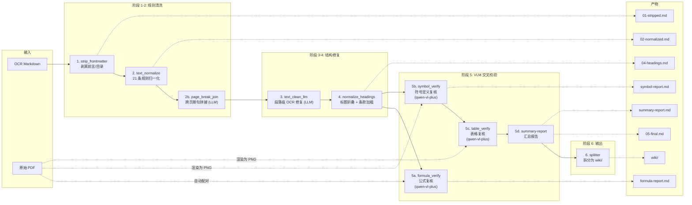

# OCR Post-Process Pipeline

[](https://www.python.org/)
[](LICENSE)

一套将商用 OCR 输出的工程规范 Markdown 自动清洗、校验、拆分到结构化 Wiki 的后处理流水线。支持多模态 VLM 交叉校验 PDF 原文，覆盖**公式、符号定义、表格**三大类 OCR 错误。

## 目录

- [数据流](#数据流)
- [技术栈](#技术栈)
- [核心创新](#核心创新)
- [模块概览](#模块概览)
- [快速开始](#快速开始)
- [各阶段详解](#各阶段详解)
- [已覆盖的 OCR 问题](#已覆盖的-ocr-问题)
- [常见问题](#常见问题)
- [与 MinerU 的对比](#与-mineru-的对比)

---

## 数据流



**每阶段中间产物落盘**，可逐阶段 diff 追踪变化。

---

## 技术栈

| 层级 | 技术 | 用途 |
|---|---|---|
| **核心语言** | Python 3.10+ | 流水线编排、规则引擎、模块化架构 |
| **多模态 VLM** | Qwen-VL-Plus (FelizAI API) | 公式修正、符号定义修复、表格复核 |
| **文本 LLM** | Qwen3.6-Plus (FelizAI API) | 跨页断句拼接、段落级 OCR 清洗 |
| **PDF 渲染** | PyMuPDF (fitz) | PDF 页面渲染为 PNG（Dpi 200） |
| **规则引擎** | Python `re` (21 条正则) | 条款编号、页码标记、数值、标点、标题修正 |
| **API 客户端** | OpenAI SDK (兼容模式) | 统一的 LLM/VLM 调用接口 + 指数退避重试 |
| **Web UI** | Flask + SSE | 拖拽上传、实时进度、PDF↔MD 同步对照 |
| **断点续跑** | JSON Checkpoint | 每条处理即写盘，中断重跑不重复调 API |
| **输出格式** | Markdown + LaTeX + HTML | 公式→`$$...$$`、表格→`<table>`、符号→`$...$` |

---

## 核心创新

### 1. 多模态 VLM 交叉校验

不同于传统 OCR 后处理仅做规则替换，本系统**将 PDF 原文渲染为图片，连同 OCR 文本一起发给 VLM 逐条校对**，实现：

- **公式复核**：734 处公式逐条对照 PDF 截图修正 LaTeX
- **符号定义复核**：检测 OCR 特有错误模式（如 `$f_{c0}$ o-描述` → `$f_{c0}$ —— 描述`），VLM 对照截图修正
- **表格复核**：124 张表格逐张对照截图修正结构和数值

### 2. 符号定义 OCR 错误专项检测

工程规范中大量符号定义行（形如 `$f_y$ —— 钢材屈服强度`）存在 OCR 系统性错误——**公式下标末尾字符被重复识别**。本系统设计了专门的正则检测 + VLM 校验双阶段流水线：

```
OCR 错误:  $f_{c0}$ o-原构件混凝土轴心抗压强度设计值
VLM 修正:  $f_{c0}$ —— 原构件混凝土轴心抗压强度设计值
```

### 3. 全流程可追溯

- **每阶段中间产物落盘**（`01-stripped.md` → `05-final.md`），每一步可 diff
- **每条 VLM 修正生成对比报告**（`formula-report.md` 含原始/修正前后对比）
- **汇总报告**（`summary-report.md`）聚合修改统计：修正率、类型分布、逐条详情
- **Checkpoint 断点续跑**：中断即停，重跑即续，已完成条目不重复调用 API

### 4. 面向工程规范的领域定制

- **21 条中文工程规范 OCR 噪声规则**：条款编号打散、百分号分离、区间连接符丢失、标题内嵌空格等
- **标题层级智能折叠**：依据"真实编号"将任意层级标题归并到 `#`/`##` 两级
- **条款编号自动加粗**：识别 `x.y.z` 条款编号并补加 `**粗体**`
- **跨页断句 LLM 拼接**：检测被页码标记截断的句子，LLM 确认后恢复

### 5. 模块化 + 可组合架构

每个阶段是独立的 `.py` 模块，可单独运行或组合。规则清洗不依赖任何 API，VLM 校验可选择性启用，拆分步骤可跳过——适配不同的处理需求。

---

## 模块概览

```
ocr-postprocess/
├── pipeline.py                          # 流水线编排器（一键入口）
├── input/                               # 放入待处理的 .md + .pdf
├── output/<规范名>/                      # 中间产物 + 报告
│   ├── 01-stripped.md                   # 剥离前言/目录
│   ├── 02-normalized.md                 # 规则归一化
│   ├── 02b-page-joined.md               # 跨页断句拼接
│   ├── 04-headings.md                   # 标题折叠
│   ├── 04b-clause-bold.md               # 条款加粗
│   ├── 05-final.md                      # 最终清洗版
│   ├── formula-report.md                # 公式复核清单（含 VLM 修正前后对比）
│   ├── symbol-report.md                 # 符号定义复核清单
│   ├── table-report.md                  # 表格复核清单
│   ├── summary-report.md                # 汇总报告（修改统计 + 详情）
│   ├── checkpoint.json                  # 断点续跑状态
│   └── wiki/                            # 拆分后的 wiki 页面
├── postprocess/                         # 核心模块
│   ├── config.py                        # API 配置（支持任意 OpenAI 兼容端点）
│   ├── checkpoint.py                    # 断点续跑引擎
│   ├── strip_frontmatter.py             # 阶段 1: 前言剥离
│   ├── text_normalize.py                # 阶段 2: 21 条正则规则
│   ├── page_break_join.py               # 阶段 2b: 跨页断句拼接 (LLM)
│   ├── text_clean_llm.py                # 阶段 3: 段落级 OCR 修复 (LLM)
│   ├── normalize_headings.py            # 阶段 4: 标题 + 条款处理
│   ├── formula_verify.py                # 阶段 5a: 公式 VLM 复核 + 修改追踪
│   ├── symbol_verify.py                 # 阶段 5b: 符号定义 VLM 复核
│   ├── table_verify.py                  # 阶段 5c: 表格 VLM 复核
│   ├── summary_report.py                # 阶段 5d: 汇总报告生成
│   └── splitter.py                      # 阶段 6: Wiki 拆分
└── webui/                               # Flask Web 界面
    ├── app.py                           # SSE 实时进度 + 上传
    └── templates/
        ├── index.html                   # 主页
        └── viewer.html                  # PDF↔MD 同步对照
```

---

## 快速开始

### 命令行

```powershell
# 1. 把待处理的 md（和对应的 pdf）放入 input/
copy raw\民用建筑设计统一标准.md              ocr-postprocess\input\
copy raw\GB 50017-2017 钢结构设计标准.pdf     ocr-postprocess\input\
#     ↑ PDF 名字和 md 一致即自动配对

# 2. 完整流水线（规则清洗 + VLM 校验 + 拆分）
python ocr-postprocess/pipeline.py

# 3. 只看报告不调 VLM（仅规则清洗 + 出复核清单）
python ocr-postprocess/pipeline.py --no-vlm

# 4. 开启 LLM 辅助（跨页断句拼接 + 段落级 OCR 修复）
python ocr-postprocess/pipeline.py --llm-clean

# 5. 只清洗不拆分
python ocr-postprocess/pipeline.py --skip-split
```

### Web UI

```powershell
pip install flask PyMuPDF requests
python ocr-postprocess/webui/app.py
# 浏览器打开 http://127.0.0.1:5000
```

功能：
- 拖拽上传 MD + PDF，自动配对
- 一键执行流水线，SSE 实时显示进度
- 已有 `output/` 结果一键加载查看
- **PDF ↔ MD 左右对照**：翻页 / 页码标记自动同步、阶段切换查看每步产出

---

## 各阶段详解

### 阶段 1: strip_frontmatter

找到第一个正文章节（`# 1 总则` / `## 1总 则` / `#### 1总则`……），丢弃之前所有前言/目录/版权内容。

### 阶段 2: text_normalize

覆盖 21 条中文工程规范常见 OCR 噪声的正则规则：

| 错误形态 | 处理 |
|---|---|
| `7.1.1 0` → `7.1.10` | 条款编号打散修复 |
| `1. $0\mathrm{m}^{3}$` → `1.0$\mathrm{m}^{3}$` | 数值在公式前被打散 |
| `3． $5\%$` → `3.5%` | 百分号被打散 |
| `$2.0m^{2}$ 、的` → `$2.0m^{2}$ 的` | 公式后多余标点 |
| `$25\mathrm{\;Pa}\;30\mathrm{\;Pa}$` → `…~30…` | 区间连接符丢失 |
| `<!-- ·7· -->` → `<!-- 7 -->` | 页码标记统一 |
| `1总 则` → `1 总则` | 标题内嵌空格 |

### 阶段 2b: page_break_join (可选 LLM)

检测被页码标记截断的句子（典型：`取0.1；对抓斗或磁盘` → `<!-- 13 -->` → `起重机，取0.15`），LLM 确认后拼接恢复。

### 阶段 3: text_clean_llm (可选 LLM)

规则归一化后仍存在的字形相近字、错误分词等段落级 OCR 乱码，逐段 + 上下文发给 LLM 做最小修复。

### 阶段 4: normalize_headings + 条款处理

将任意层级标题折叠为 `#`/`##` 两级，依据"真实编号"智能判断。同时清理 OCR 自带裸数字加粗、补充 `x.y.z` 条款编号加粗。

### 阶段 5: VLM 交叉校验

**5a. formula_verify** — 扫描全部 `$$...$$` 公式块，渲染对应 PDF 页为 PNG，VLM 逐条校对后回填修正，记录原始/修正对比。

**5b. symbol_verify** — 扫描全文 `$...$` 符号定义行，检测 OCR 字符重复 + 破折号丢失错误，VLM 对照截图修正。

**5c. table_verify** — 扫描全部 `<table>...</table>`，VLM 逐张对照 PDF 修正结构和数值。

**5d. summary-report** — 聚合三类修改的统计和详情，输出 `summary-report.md`。

### 阶段 6: splitter

调用 `scripts/split_wiki.py` 将清洗后的 md 按 5 页拆段、1 页重叠的规则拆分为 wiki 页面。

---

## 已覆盖的 OCR 问题

`wiki-拆分指导.md` §2.4 的全部坑点均被覆盖：

- 标题层级混乱（`#### 7室内环境`、`### 7.1光环境`）
- 页码标记变体（`<!-- ·7· -->`）
- 条款编号打散（`7.1.1 0`、`1. $0\mathrm{m}^{3}$`）
- 公式后多余标点（`$2.0m^{2}$ 、的`）
- 区间连接符丢失（`$25...\;30...$`）
- 前言/目录/版权页残留
- 跨页断句碎片
- OCR 自带裸数字加粗（`**1**`）
- 条款编号未加粗（`1.0.1 为使...`）
- 符号定义 OCR 错误（`$f_y$ y-描述` → `$f_y$ —— 描述`）

---

## 常见问题

### API 连接失败 (SSL / Connection error)

默认 `trust_env=False`，绕过系统代理直连 API。若必须走代理：`set FELIZ_TRUST_ENV=1`。

### 断点续跑

公式/符号/表格复核每处理一条即写 `checkpoint.json`。中断后重新执行同一命令即可从断点继续，已完成条目不重复调用 API。

### 瞬时网络抖动

内置最多 5 次指数退避重试（2s → 4s → 8s → 16s → 60s），仍失败则稍后重跑。

---

## 与 MinerU 的对比

本项目设计参考了 [opendatalab/MinerU](https://github.com/opendatalab/MinerU) 的架构理念：

| MinerU 做法 | 本仓库对应 |
|---|---|
| 识别/后处理拆成独立模块 | 12 个 `.py` 各管一阶段，中间产物全落盘 |
| 公式→LaTeX，表格→HTML | `formula_verify` + `table_verify` |
| 公式/表格独立模块可单独跑 | 每个 verify 模块独立可运行 |
| 中间结果显式落盘 (`middle.json`) | `01-stripped.md` … `05-final.md` 每阶段可 diff |
| 阅读顺序单独兜底 | 以 OCR 模板顺序 + 页码标记切块，章节代替坐标 |
| 后处理集中清理页眉页脚 | `strip_frontmatter` + `page_break_join` |

**本项目的差异化优势**：多模态 VLM 交叉校验 PDF 原文截图，而非仅做规则清理。符号定义 OCR 错误专项检测是国内工程规范深度定制的能力。
